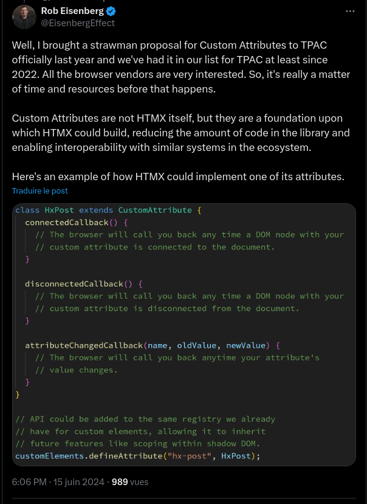

<p>
  <a href="https://www.npmjs.com/package/@web-component-attribute-polyfill/core">
    
  </a>

  <a href="https://github.com/rochejul/web-component-attribute-polyfill/blob/main/LICENSE">
    
  </a>
</p>

# web-component-attribute-polyfill

Create a polyfill to allow to have an "attribute" web component (rather a tag web component)

## Motivation

We are into the age of Web components, but we could at this time only create custom elements, and not custom attributes.

## What we could find in frameworks

A long time, we used a framework called [AngularJs](https://docs.angularjs.org/) and this framework allowed to create `attribute directive`.

With this approach we could introduce the behavior approach such as [Wicket](https://nightlies.apache.org/wicket/apidocs/8.x/org/apache/wicket/behavior/Behavior.html) where we augment the capability of our component with delegations.

## Web community position

It seems some people such as [Rob Eisenberg](https://eisenbergeffect.medium.com/) started some discussion on [this topic](https://x.com/EisenbergEffect/status/1802009857488285966):



At this time there is no official polyfill, because there is no official proposition yet

## Usage

On the [customElements](https://developer.mozilla.org/fr/docs/Web/API/Window/customElements) property, we will find the `defineAttribute` method used to declare the name of the custom attribute, and the implementation.

We should extend the `CustomAttribute` class which exposes:

- the `connectedCallback` method used when the element where is used the custom attribute is injected into the DOM
- the `disconnectedCallback` method used when the element where is used the custom attribute is removed from the DOM
- the `attributeChangedCallback` method used when the custom attribute's value has changed
- the `element` property which reflects the element where is used the custom attribute

You could see in the [demo folder](./demo/) a way to use the polyfill.

Ensure to import the polyfill, through an import:

```js
import * as polyfill from '@web-component-attribute-polyfill/browser';
```

Or from the HTML `script` tag:

```html
<script defer="defer" src="./node_modules/@web-component-attribute-polyfill/browser/build/bundle.js">
```

Then declare your custom attribute:

```js
class BorderStylingAttribute extends globalThis.CustomAttribute {
  attributeChangedCallback(name, oldValue, newValue) {
    super.attributeChangedCallback(name, oldValue, newValue);
    this.applyColor(newValue);
  }

  connectedCallback() {
    super.connectedCallback();
    this.element.style.padding = '1rem';
    this.element.style.border = '3px solid black';
    this.element.style.borderRadius = '1rem';
    this.applyColor();
  }

  applyColor(styling) {
    if (styling === 'variant') {
      this.element.style.borderColor = 'red';
    } else {
      this.element.style.borderColor = 'black';
    }
  }
}

customElements.defineAttribute('border-styling', BorderStylingAttribute);
```

And at the end, use it on your elements:

```html
<article border-styling="default">Some article tag</article>

<div>
  <template shadowrootmode="open">
    <article border-styling="default">Some article tag</article>
  </template>
</div>
```

## Commands

- `npm run dev:build`: Build the project over packages
- `npm run dev:bump`: Bump the project's version (don't forget to push the commit and the tag)
- `npm run dev:check`: Run tests and styling over packages
- `npm run dev:format`: Format files over packages
- `npm run dev:format:check`: Check files format over packages
- `npm run dev:linting`: Lint files over packages
- `npm run dev:publish`: Publish all the packages on npm registry
- `npm run dev:styling`: Format and lint files over packages
- `npm start`: Run the vanilla demo
- `npm run start:ts`: Run the typescript demo
- `npm test`: Run tests over packages
- `npm run test:coverage`: Run tests over packages and see coverage reports

## Contributing

- [Guidelines](./docs/GUIDELINES.md)
- [Contributing](./docs/CONTRIBUTING.md)
- [Code of conducts](./docs/CODE_OF_CONDUCTS.md)
